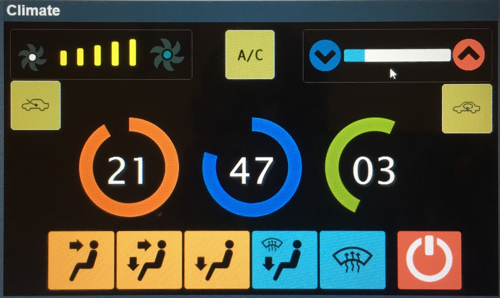
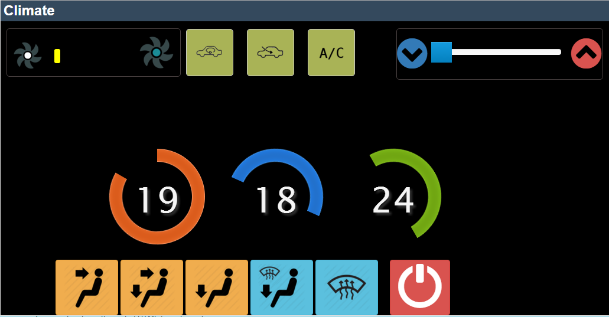

# DIY Windows Tablet Car Climate Control

## Description

Rig the target car's climate control with this setup. Tested on a 95 Honda Civic.
This setup is basically intended to overide the vehicles circuit so that you can control it from a touch screen.
Include Python and PHP scripts which you can customize to fit your needs.





## Features

- Fan speed control
- Temperature regulation
- Vents control
- Clock
- AC ON/OFF

## Parts and tools required

- Arduino uno
- Wires
- Relays (8)
- Breadboard
- Servo
- LEDs
- Solder/Soldering iron

> Further instructions will follow soon.

## Control Codes

```txt

Code - Pin - Action

999 -- Close all output pins

Servo
10-90 - 5 - Control servo angle 0-90 deg.

Vents
190 - 6 - Face vent
191 - 7 - Face and feet vents
192 - 8 - Feet vent
193 - 9 - Feet and windows vents
194 - 10 - Windows vents
195 -- All vents offs

Airflow
196 - 11 - Circulate air inside
197 - 12 - Circulate air from outside

AC
198 - 13 - AC on
199 -- AC - off

Fan
300 -- Fan Off. AC Off
325 - A1 - Fan speed 1 (min)
350 - A2 - Fan speed 2
375 - A3 - Fan speed 3
400 - A4 - Fan speed 4 (max)
```

> This is for education purposes only. If you alter your car and void warrantly, cause damage, personal injury or any other
> imaginable scenario, thats on YOU!
